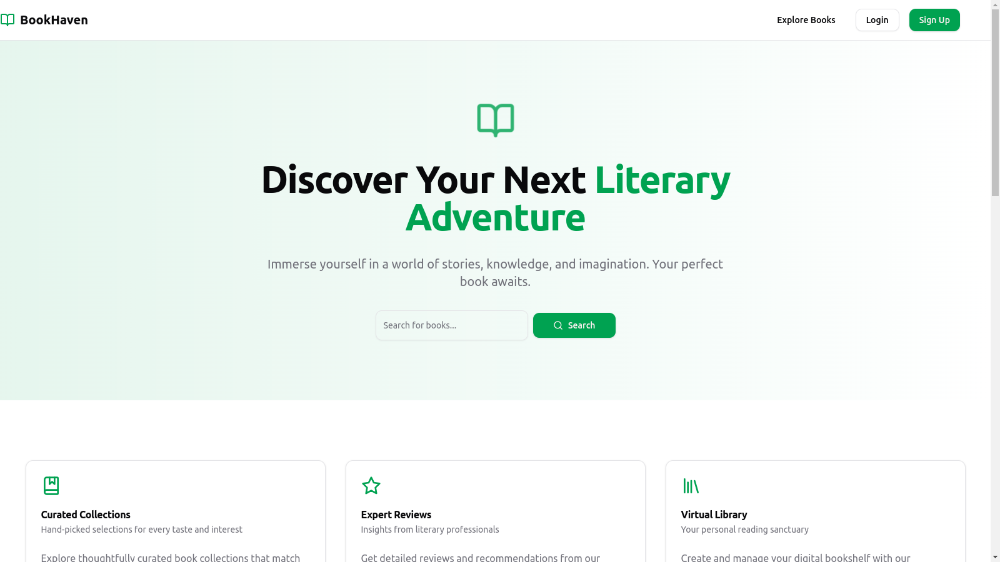
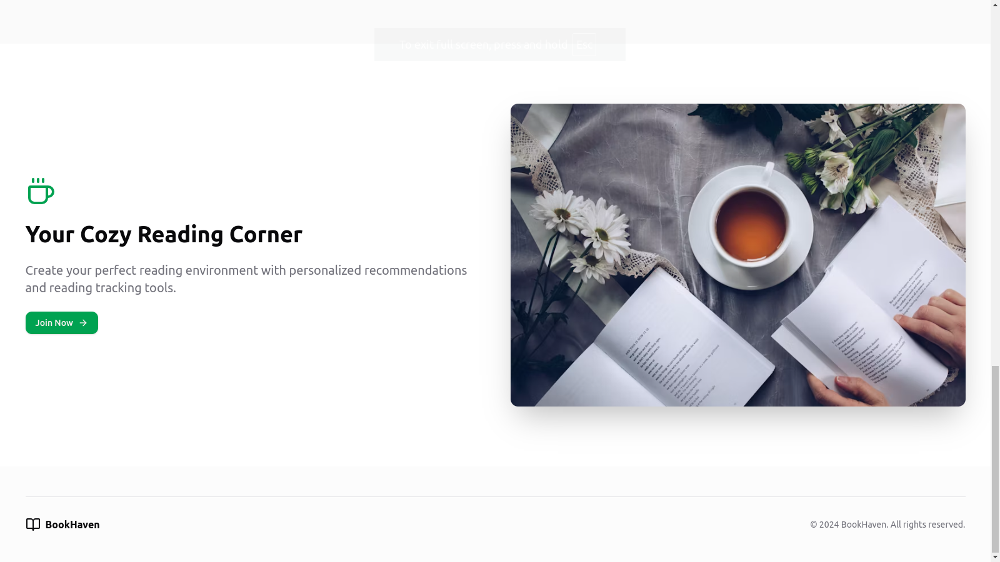

# Book Heaven

Welcome to **Book Heaven** - your one-stop solution to find, read, review, and manage books!




---

## Table of Contents
- [Introduction](#introduction)
- [Features](#features)
- [Installation](#installation)
- [Usage](#usage)
- [Contributing](#contributing)
- [License](#license)
- [Contact](#contact)

---

## Introduction
**Book Heaven** is a web application that allows users to explore an extensive library of books, read summaries, leave reviews, rate books, and create personalized reading lists. Whether you're a casual reader or a bookworm, Book Heaven offers a user-friendly experience to manage your reading journey.

---

## Features
- **Book Catalog**: Browse a vast collection of books across different genres.
- **Search and Filter**: Quickly find books using advanced search and filters.
- **Reviews and Ratings**: Read and write reviews, and give star ratings.
- **Personalized Reading List**: Create and manage your own reading list.
- **Book Recommendations**: Get personalized book recommendations based on your interests.
- **User Profiles**: Manage your profile and track your reading progress.

---

## Installation

To set up **Book Heaven** locally, follow these steps:

1. Clone the repository:
   ```bash
   git clone https://github.com/username/Book Heaven.git
